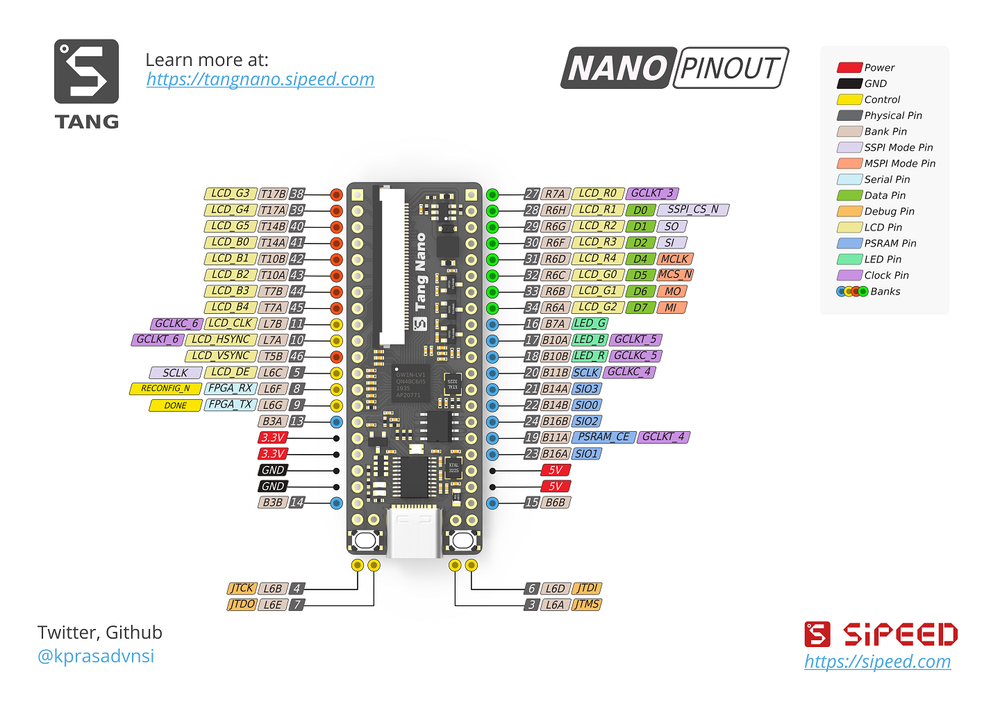

# Lichee Tang Nano Demo

> Lichee Tang Nano 是一块 [Sipeed](https://wiki.sipeed.com/hardware/zh/tang/Tang-Nano/Nano.html) 的FPGA开发板，其芯片为高云GW1N-LV1QN48C6/I5

## 搭建开发环境

开发环境为高云云源软件，此芯片需要使用商业版，需要申请license，下载地址 [云源软件](http://www.gowinsemi.com.cn/faq.aspx)

